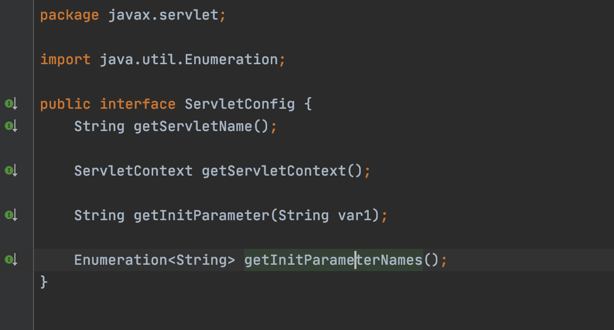

## Servlet

### Servlet基础


Servlet的生命周期主要包括：加载实例化，初始化 ，service服务处理客户端请求，destory方法销毁。

- Servlet的加载实例化由Web容器负责，在默认情况下，Servlet为初次访问时被创建，但也可以通过load-on-startup来配置使得Servlet随服务器的启动而创建，在创建的时候会执行init方法
- Servlet初始化主要由init方法负责，init方法的参数为ServletConfig类型，在Servlet被创建后的初始化阶段，会将web.xml中的Servlet标签中对应的信息封装为ServletConfig对象传入init。
- Servlet的核心方法为service方法，逻辑主要为对客户端请求的处理，比如Tomcat中核心Servlet类HttpServlet则是把请求转发处理doGet，doPost等方法封装在service中，也方便后续类继承后，直接重写具体的请求对应函数即可。
- destroy方法在容器正常关闭的时候进行调用


#### Servlet线程安全问题

Servlet容器中，每个Servlet类只对应一个对象，所有请求将由一个生成的Servlet对象处理，所以可能会造成线程安全。

解决这个问题的方法为将为定义的Servlet类实现SingleThreadModel接口，这样将意味着一个Servlet对应着一个线程，web容器内将会存在多个Servlet对象。


### ServletConfig




ServletConfig默认实现的方法如上

- String getServletName() -- 获取当前Servlet在web.xml中配置的名字
- String getInitParameter(String name) -- 获取当前Servlet指定名称的初始化参数的值
- Enumeration getInitParameterNames() -- 获取当前Servlet所有初始化参数的名字组成的枚举
- ServletContext getServletContext() -- 获取代表当前web应用的ServletContext对象


### ServletContext

ServletContext为域对象，作用是在整个Web应用的动态资源之间共享数据，同为域对象的Session域和Request域，也都可以获得ServletContext对象


#### 获取ServletContext

```java
ServletConfig#getServletContext()
GenericServlet#getServletContext() (其实也是通过ServletConfig对象去拿)
HttpSession#getServletContext()		#session.getServletContext()
HttpServletRequest#getServletContext()	#request.getServletContext()
ServletContextEvent#getServletContext()

```


#### 全局属性保存获取

```java
setAttribute getAttribute
```

可在不同Servlet之间形成资源共享


#### Web静态资源获取

```java
InputStream in = this.getServletContext().getResourceAsStream("/WEB-INF/classes/db.properties");


String path = this.getServletContext().getRealPath("/WEB-INF/classes/db.properties");


URL url = this.getServletContext().getResource("/WEB-INF/classes/db.properties");

```


#### 获取Web应用配置信息


```java
getInitParameter
```


### ServletRequest/ServletResponse

#### Request

Servlet初始化完成后接受客户端的请求，这些请求会被封装了ServletRequest类型和ServletResponse类型的对象，后通过service进行处理，返回给客户端

完整的Request URL由 ContextPath+ServletPath+PathInfo组成

对于Request的常见API如下：

https://juejin.cn/post/6844904196223795207#heading-12


#### Response


向浏览器发送数据

```java
ServletOutputStream getOutputStream() throws IOException;

PrintWriter getWriter() throws IOException;


demo:
ServletOutputStream os = response.getOutputStream();
os.write(buffer,0,len)
```

